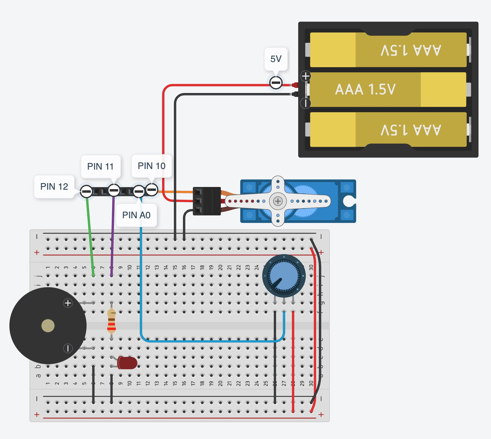

# MQTT - Examples

This folder contains examples of communication via MQTT protocol. Read more about MQTT here: <https://mqtt.org/>

## Sofware installation

1. You need to have Arduino IDE configured for ESP32 as described in [this link](<https://learn.sparkfun.com/tutorials/installing-board-definitions-in-the-arduino-ide/installing-a-third-party-board-definition).
   - Preferences > Settings > Additional Boars Manager URLSs
   - Paste in the field the URL: `https://raw.githubusercontent.com/espressif/arduino-esp32/gh-pages/package_esp32_index.json`
2. You also need to add to Arduino IDE the library `PubSubClient`, more about the library in [this link](http://pubsubclient.knolleary.net/api)
   - Tools > Manage Libraries
   - Search for 'PubSubClient' and install

## Hardware installation

The complete example is in `05_MQTT_Client_Digital_Analog_PWM`. The sketch performs bidirectional communication of digital and analog inputs via MQTT messages.

To get started, explore incrementally from the first sketch in this folder.

To deploy the example, build the circuit following these pins in the ESP32-S2.

**INPUT:**
- `[D0]` Built-in Digital Button 
- `[PIN A0]` Analog Potentiometer 

**OUTPUTS**
- `[PIN 13]` Digital Built-in LED 
- `[PIN 12]` Active Buzzer 
- `[PIN 11]` Analog LED with 220-ohm resistor 
- `[PIN 10]` Servo connected to 5V instead of 3.3V 

> ⚠️ **NOTE: The diagram is only as reference**. You likely need to edit the PINs in the sketch code to match your board type and circuit connections.

